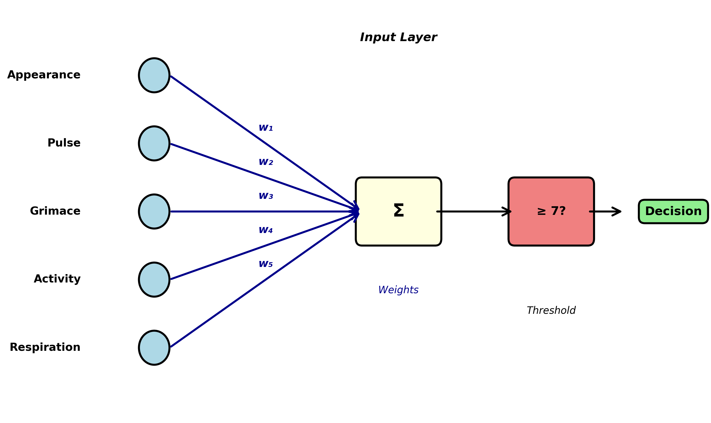

# Why Your Model Beats You: Bayesian Decision-Making Without Noise

*From Kahneman's Fallacies to Neural Networks That Replace Human Judgment*

*Johannes Siedersleben, assisted by Claude Sonnet 4.5     
November 2025*

---

We are easily fooled. Daniel Kahneman's *Thinking, Fast and Slow* {cite}`kahneman2011thinking` opens with a devastating example. Imagine two lists. The first contains personality descriptions: "a meek and tidy soul with a need for order and structure." The second lists professions: librarian, farmer, airline pilot, accountant. Your task: estimate how likely a given individual works in each profession.

Most people ask: "How well does the description match?" Meek and tidy? Sounds like a librarian! 
But this intuition ignores the fact that some professions are vastly more common than others. 
However perfectly a personality fits an astronaut or lighthouse keeper, these professions are so rare that the actual probability remains minuscule.

Kahneman calls this "What You See Is All There Is" (WYSIATI, pronounced 'wizzy-AH-tee')—our tendency to judge based solely on available information while ignoring what's missing. What people systematically forget is the **base rate**: the underlying frequency of each profession. There are thousands of accountants for every lighthouse keeper, regardless of personality fit.

The correct probability must be approximately the product of base rate (how common is this profession?) and personality match (how well does this person fit?). Understanding this product is the gateway to Bayesian reasoning {cite}`pearl2018book`.
For a readable, instructive, and, at times, humorous introduction to the strange world of Bayes, see {cite}`mcgrayne2011theory`.

This essay traces a journey: from Kahneman's insights about human fallibility through Bayesian tests to a surprising conclusion—trained automatons (neural networks making decisions from weighted scores) systematically outperform human experts. The implications for medicine, insurance, criminal justice are profound and troubling. We begin with musicians.


## Musicians and Base Rates

Let's examine professional musicians. Suppose:
- **Base rate**: 0.1% of the population are professional musicians (1 in 1,000 people)
- **Musical giftedness**: 5% of the population is musically gifted (50 in 1,000 people)
- **Assumption**: All professional musicians are musically gifted (a simplification, but reasonable)

Now consider a person selected at random from the population. If we learn nothing about them, their probability of being a professional musician is simply the base rate: 0.1%. But suppose we learn they are musically gifted. How does this change the probability?

Here's the calculation:

| Population Category | Count (per 1,000) | Percentage |
|---------------------|-------------------|------------|
| General population | 1,000 | 100% |
| Professional musicians | 1 | 0.1% |
| Musically gifted people | 50 | 5% |
| Musicians among the gifted | 1 | — |
| **P(musician \| gifted)** | **1/50** | **2%** |

The probability jumps from 0.1% to 2%—a twentyfold increase. Yet the person is still overwhelmingly unlikely to be a professional musician. Among the 50 musically gifted people, 49 have chosen different careers or never developed their talent professionally.

This pattern is ubiquitous in medical diagnosis, security screening, machine learning, and everyday reasoning. Understanding it requires some terminology:

- **Evidence**: Information that is readily available (here: "is musically gifted")
- **Hypothesis**: What we're trying to determine about the underlying reality (here: "is a professional musician")
- **Base rate**: Prior probability of the hypothesis before considering evidence (here: 0.1%)
- **Likelihood**: Probability of observing the evidence (here: 5%)
- **Likelihood ratio**: The multiplicative factor by which evidence changes probability (here: 20)

The likelihood ratio quantifies the information gained from the evidence. A ratio of 20 is excellent; in many real-world applications, we're lucky to achieve 10.

## Bayesian Tests: The Cancer Screening Problem

The same pattern applies to medical diagnosis. Consider cancer screening: the patient has cancer (hypothesis); the test is positive (evidence); prevalence is 0.1% (base rate). Let's work through actual numbers. Screen 10,000 people:

**Given:**
- Base rate: 0.1% (10 people in 10,000 have cancer)
- The test correctly detects 95% of people who actually have cancer
- The test correctly identifies 95% of people who don't have cancer

**Calculation:**
- Among 10 people with cancer, the test detects: 10 × 95% = 9.5 (**true positives**, TP)
- Among 10 people with cancer, the test misses: 10 × 5% = 0.5 (**false negatives**, FN)
- Among 9,990 people without cancer, the test correctly identifies: 9,990 × 95% = 9,490.5 (**true negatives**, TN)
- Among 9,990 people without cancer, the test incorrectly flags: 9,990 × 5% = 499.5 (**false positives**, FP)

**Results:**
- Total positive tests: TP + FP = 9.5 + 499.5 = 509
- Precision (positive predictive value): TP/(TP + FP) = 9.5/509 = **1.9%**

Out of 509 people who test positive, only 9.5 actually have cancer. That's 98.1% false positives. Most patients—and many physicians—find this deeply counterintuitive {cite}`gigerenzer2002calculated`. A test that is "95% accurate" produces overwhelming numbers of false alarms.

This is not a defect of the test. It's an inevitable consequence of screening for rare conditions. When the base rate is 0.1% and the false positive rate is 5%, you will necessarily get 50 times more false positives than true positives. This fundamental asymmetry affects not just medical screening but scientific research itself: most published findings in fields with low prior probabilities are likely to be false positives {cite}`ioannidis2005why`.


### The Confusion Matrix

The confusion matrix organizes these four outcomes systematically:

|                       | **Cancer Absent** | **Cancer Present** | **Total** |
|-----------------------|:-----------------:|:------------------:|:---------:|
| **Test Negative**     | TN = 9,490.5      | FN = 0.5           | 9,491     |
| **Test Positive**     | FP = 499.5        | TP = 9.5           | 509       |
| **Total**             | 9,990             | 10                 | 10,000    |

Understanding this matrix is crucial for evaluating any classification system—whether medical diagnosis, spam detection, or criminal risk assessment.

### Four Ways to Measure Performance

From the confusion matrix, we can derive multiple performance metrics. The terminology here is standard but notoriously confusing, so let's define each term precisely:

| Metric | Formula | Value | Interpretation |
|--------|---------|-------|----------------|
| **Sensitivity (Recall)** | TP/(TP+FN) | 95% | Among people with cancer, what percentage does the test detect? |
| **Specificity** | TN/(TN+FP) | 95% | Among people without cancer, what percentage does the test correctly identify? |
| **Precision (PPV)** | TP/(TP+FP) | 1.9% | Among people who test positive, what percentage actually have cancer? |
| **Accuracy** | (TP+TN)/(TP+TN+FP+FN) | 95% | Overall, what percentage of all classifications are correct? |

The test has 95% sensitivity (catches 95% of actual cancers), 95% specificity (correctly identifies 95% of healthy people), and 95% overall accuracy. These numbers all sound excellent. Yet the precision—the answer to the question a patient with a positive test actually asks ("Do I have cancer?")—is merely 1.9%. This is the paradox of screening for rare conditions.

**False negatives** are catastrophic—missing someone who actually has cancer. Fortunately, with 95% sensitivity, these are rare (0.5 cases in our example).

**False positives** are merely anxiety-inducing—telling someone they might have cancer when they don't. Unfortunately, these are common (499.5 cases in our example).

For all their limitations, Bayesian tests have been the foundation of 
medical diagnosis, quality control, security screening, and scientific inference for over a century. 
They remain indispensable because the alternative—human intuition—is systematically worse.

### The Asymmetry Between Lab and Field

There is a deep asymmetry between developing a test and deploying it. Pharmaceutical companies typically develop tests in 
laboratory settings with carefully balanced populations: perhaps 500 people with cancer and 500 without. 
The test's job is to distinguish these two equal-sized groups. 
The point is this: In the lab, you see both ends (evidence and hypothesis), but in the field, 
only the evidence is available and the hypothesis has to be predicted.

In this balanced setting, the same 95% sensitivity and 95% specificity yield vastly different results:
- True positives: 500 × 95% = 475
- False positives: 500 × 5% = 25
- Precision: 475/(475+25) = **95%**

The precision is excellent! The test appears to work beautifully.

But when deployed in the field on the general population—where only 0.1% have cancer—that same test's precision collapses to 1.9%. The test hasn't changed; the population has. This asymmetry between development (balanced populations) and deployment (real-world base rates) is the source of most Bayesian confusion and most real-world disappointment with screening programs.


### Causality
In the previous example, the evidence was a "positive test result", and the hypothesis was "has cancer". 
The likelihood ratio quantifies the extent to which our knowledge increases.
The hypothesis (cancer) causes the test result, with the imponderables discussed earlier.
This is a ubiquitous pattern: fire causes alarm, the signal sent causes the signal received, 
the physical phenomenon causes what the physicist observes on his measuring device.

Now consider an analogous example:
Let the evidence be "is a smoker" and the hypothesis "has lung cancer". 
Again, the likelihood ratio quantifies our increased knowledge. 
We learn how much more likely a smoker is to contract cancer.
However, in this case, the causality works the other way around: 
It is smoking that causes lung cancer!
There is a crucial difference, however: The patient has to accept the test result; he can do nothing about his health.
But the smoker can stop smoking, and the non-smoker can refrain from starting to smoke.

However, this is not the end of the story, as the following example illustrates. 
It's a fact that bald men tend to be wealthier than men with a full head of hair.
This is because bald men tend to be older, and older men tend to have more money.
Let the evidence be "is bald" and the hypothesis "is wealthy". 
In this case, the causality works neither way,
having your head shaved won't affect your chances of getting rich.

To make matters worse, we finish with intelligent philosophers. 
Let's assume that, according to a study, philosophy students are particularly intelligent.
In this case, the evidence is "intelligent", and the hypothesis is "philosopher". One wonders: 
Are philosophy students intelligent because they study philosophy? 
Or do they study philosophy because they are intelligent? You decide.

This was just a quick glance at the fascinating question of causality, which was beautifully developed by J.Pearl and his team 
in {cite}`pearl2018book`, {cite}`pearl2009causality`, {cite}`pearl2016causal`.


## The Apgar Test Is a Neural Network

The Apgar test, developed in 1952, assesses newborn babies worldwide. A physician observes five criteria immediately after birth:

1. **A**ppearance (skin color)
2. **P**ulse (heart rate)
3. **G**rimace (reflex response)
4. **A**ctivity (muscle tone)
5. **R**espiration (breathing)

Each criterion receives a score of 0 (poor), 1 (fair), or 2 (good). The five scores are summed to produce the Apgar score, ranging from 0 to 10. A score of 7 or higher indicates a healthy newborn; a score below 7 indicates a baby requiring immediate medical attention.

The Apgar test fits perfectly into our Bayesian framework:
- **Evidence**: The five observable scores
- **Hypothesis**: The baby is healthy or critical
- **Decision rule**: Score ≥ 7 → healthy; score < 7 → critical

The test could function as a decision automaton: observe, score, sum, compare to threshold, act. In practice, of course, a responsible physician is present, and the test guides rather than replaces human judgment.

### From Fixed Weights to Trained Weights

The original Apgar test treats all five criteria equally—each contributes 0, 1, or 2 points. 
But is this optimal? Perhaps appearance matters more than grimace; perhaps pulse outweighs respiration.
Let's assume, by way of a thought experiment, that life is more complicated and that the Apgar test, as we know it, produces poor results.
How would we determine the best weights? 

Modify the test to use arbitrary weights w₁, w₂, w₃, w₄, w₅ (summing to 1):

**Weighted Apgar Score** = w₁×(appearance) + w₂×(pulse) + w₃×(grimace) + w₄×(activity) + w₅×(respiration)

Finding optimal weights: collect data from 1,000 newborns (five scores plus true health status); frame as optimization (1,000 equations, five unknowns); solve mathematically (least squares or gradient descent); deploy the trained weights.

**Congratulations: you have just trained your first neural network.**

This is not a metaphor or analogy. The weighted Apgar test *is* a neural network—specifically, a single-layer perceptron with five inputs, one output, and no hidden layers. 
The architecture looks like this:



This is not a toy example or simplification. Real-world neural networks use exactly this principle, scaled up:
- More inputs (50, 500, or 50,000 features instead of 5)
- Hidden layers (intermediate processing stages)
- Nonlinear activation functions (allowing more complex relationships)
- Billions of weights instead of five

But the fundamental idea is identical: find numerical weights that transform inputs into predictions, and optimize those weights using training data.

The trained Apgar test (and every neural network) fits perfectly into the Bayesian testing framework. 
It produces predictions (evidence) about underlying states (hypotheses). 
It can be evaluated using precision, recall, accuracy, and specificity. 
It will produce false positives and false negatives. 
And like all Bayesian tests, its quality depends critically on the quality of the training data:
Ideally, it should accurately represent the world, including factors such as gender, race, or parents' social status.
Do newborn babies in Australia match the same parameters as those in India? 
Whatever criteria you can think of should be accurately represented, but achieving that is, in general, impossible.
This is the crucial, inescapable issue of bias.

## From Apgar to Insurance: Scaling Up

From medical diagnosis with five features to commercial decisions with dozens. Consider an insurance company automating claims processing.

### Step 1: Convert Reality to Numbers

The first challenge: represent each claim as numerical scores. For auto insurance:

1. **Claim amount** (normalized to $0-100k range)
2. **Days since policy purchase**
3. **Claimant age**
4. **Number of previous claims** (in last 5 years)
5. **Police report filed?** (binary: 0 or 1)
6. **Independent witness statements?** (count: 0, 1, 2, ...)
7. **Photos provided?** (count: 0, 1, 2, ...)
8. **Damage assessment matches photos?** (binary)
9. **Claimant response time** (hours to first contact)
10. **Repair shop reputation score** (0-100)
11. **Claimant credit score** (normalized)
12. **Time of day of incident** (encoded as hour 0-23)
13. **Weather conditions** (clear/rain/snow/fog encoded)
14. **Claim description coherence score** (0-100, from NLP analysis)
15. **Prior claims in same location?** (binary)
... and perhaps 35-85 more features

Choosing these features requires domain expertise, legal knowledge (what are we allowed to consider?), and practical judgment (what data can we reliably obtain?). This is emphatically not automated—it's skilled human work.

### Step 2: Gather Training Data

The company needs historical data: thousands of past claims with:
- All feature scores
- The final decision (approved or denied)
- Ideally, whether that decision was correct (did fraud eventually surface? did legitimate claims get wrongly denied?)

Suppose they have 10,000 historical claims with known outcomes.

### Step 3: Train the Model

Using the same mathematical techniques as the weighted Apgar test (but with more sophisticated algorithms capable of handling 50+ features), 
the company finds the weights that best predict historical decisions:

**Claim Score** = w₁×(claim_amount) + w₂×(policy_age) + ... + w₅₀×(feature₅₀)

If the score exceeds some threshold, approve the claim. If it falls below, deny or flag for human review.

**Note:** In reality, the company would probably choose a model with more layers and many more parameters rather than a simple one-layer perceptron.
But the key ideas are identical.

### Step 4: Deploy and Monitor

The trained model processes new claims automatically. Claims with clear scores (very high or very low) are decided automatically. Claims near the threshold are flagged for human review.

This is precisely analogous to the Apgar test, the cancer screening, and the musician example. It's a Bayesian classifier making decisions based on evidence. And if the training data is good—if it represents the full diversity of legitimate and fraudulent claims—the model can be excellent.

But there's a crucial difference between babies and insurance claims.

## The Problem of Ground Truth

Newborn babies have objective ground truth: we monitor vital signs over hours, run blood tests, consult specialists, determine with near-certainty whether the baby was truly healthy. Cancer screening too: biopsies, follow-up imaging, eventual confirmation.

But for many real-world decisions, there is **no objective ground truth**:

### Insurance Claims
An insurance adjuster decides whether a claim is legitimate or fraudulent. But this decision itself is judgment-based. There's no lab test for fraud. The "ground truth" in the training data is just another human's opinion. When we train a model on these decisions, we're training it to replicate human judgment—including human biases, blind spots, and inconsistencies.

### Criminal Sentencing
A judge decides whether a defendant is high-risk or low-risk for reoffending. But this is predictive judgment, not observable fact. The training data consists of past judicial decisions and subsequent recidivism rates. A model trained on these decisions learns to reproduce judicial patterns—including racial biases, socioeconomic prejudices, and geographic disparities that characterize the justice system.

### Loan Applications
A bank decides whether to approve a loan. The "ground truth" is whether the person defaulted. But this is affected by the bank's own decision: denying a loan to someone who would have repaid it creates no training signal (we never learn what would have happened). The training data is systematically incomplete.

### Medical Triage
An emergency room nurse decides which patients need immediate attention. The "ground truth" is patient outcomes—but these are affected by the triage decision itself. Patients sent home might have recovered regardless, or might have deteriorated because they were sent home. Cause and effect are entangled.

This is the fundamental problem of training decision-making systems: **we are training models to reproduce human decisions, not to discover objective truths**. The model learns human biases as faithfully as it learns human expertise. It becomes a consistent version of human judgment—bias included.

## Why Automatons Beat Humans Anyway

Given that models learn from flawed human decisions, why would they outperform humans? This is the central thesis of Kahneman's *Noise: A Flaw in Human Judgment* {cite}`kahneman2021noise`: trained automatons systematically beat human experts at decision-making because they eliminate **noise**.

### What is Noise?

Noise is random variability in human judgment:

**Occasion noise**: The same person, different times—Monday morning vs. Friday afternoon; before lunch vs. after; well-rested vs. exhausted; after approving three claims vs. after denying three.

**Mood noise**: Emotional states alter judgment—anxiety, anger, depression shift risk assessment; personal events (spousal argument, traffic jam) color decisions; weather, temperature, even sports results influence judges and parole boards.

**Context noise**: Irrelevant information affects decisions—the order of case review; anchoring on previous cases; arbitrary reference points mentioned in conversation.

Studies documenting occasion noise are disturbing:
- Judges grant parole more often right after lunch than before lunch
- Radiologists are more likely to detect anomalies early in their shift
- Loan officers are harsher after denying several applications in a row
- Insurance adjusters vary by ±30% in claim approval rates on identical cases

This variability is not bias (systematic error). It's noise (random error). Two experts reviewing the same case on different days can reach opposite conclusions. The same expert reviewing the same case twice may contradict themselves.

### The Automaton Advantage

Now suppose you train a model on one particular expert's decisions—their judgments over thousands of cases spanning several years. That model learns to predict what the expert would decide. But crucially, the model has several advantages:

1. **No occasion noise**: The model has no Mondays, no lunch breaks, no bad nights
2. **No mood noise**: The model has no emotions, no quarrels with partners, no traffic jams
3. **No context noise**: The model doesn't anchor on previous cases or get influenced by irrelevant details

The model represents that expert's judgment **with the noise removed**. It captures their consistent patterns while eliminating their random fluctuations.

As Kahneman puts it: **Your model beats you, and it beats you consistently.**

This is deeply counterintuitive. We expect humans to beat machines at tasks requiring judgment. But Kahneman's research shows that in high-volume decision-making—insurance claims, loan applications, medical triage, parole decisions—trained automatons outperform the experts whose decisions they learned from.

The automaton is not smarter than the expert. It's more consistent. And in many domains, consistency matters more than peak performance.

### Evidence from Real Systems

Several large-scale studies support this conclusion:

**Medical diagnosis**: Simple algorithms predicting heart attack risk outperform cardiologists' intuitive judgments (because the algorithms apply consistent criteria).

**Recidivism prediction**: The COMPAS algorithm (despite its controversies) predicts reoffending more consistently than parole boards (though it inherits their biases).

**Insurance underwriting**: Automated systems approve/deny claims more consistently than human adjusters (though they sometimes miss unusual cases requiring human judgment).

**Academic admissions**: Weighted formulas combining GPA and test scores predict college success better than holistic human review (though they may miss important qualitative factors).

The pattern is clear: in domains with:
- High volume (thousands of decisions per year)
- Clear features (observable, quantifiable information)
- Historical data (past decisions and outcomes)
- Tolerable error rates (no single decision is catastrophic)

...trained automatons systematically outperform human experts.

## When Should Automatons Decide?

Not all decisions should be automated. The critical question is: when is automation appropriate, and when does it cross ethical lines?

### The Appropriate Domain for Automation

**High-volume, moderate-stakes decisions with clear features:**
- Insurance claim processing (most claims are routine)
- Fraud detection (flag suspicious transactions for human review)
- Medical triage (prioritize patients for human examination)
- Loan pre-approval (initial screening before human underwriting)
- Spam filtering (users can check spam folders)
- Quality control (flag defective products for human inspection)

These domains share several characteristics:
- Thousands or millions of decisions required
- Features can be quantified reliably
- Errors are tolerable (false positives get human review; false negatives are rare)
- Speed and consistency matter
- Humans can intervene in edge cases

### The Inappropriate Domain for Automation

**Low-volume, high-stakes decisions requiring explanation:**
- Criminal sentencing (individual liberty at stake)
- Medical diagnosis for serious conditions (life-or-death consequences)
- Child custody decisions (profound impact on multiple lives)
- Asylum and immigration decisions (deportation vs. safety)
- Academic expulsion or professional license revocation (irreversible harm)

These domains share different characteristics:
- Each decision is individually significant
- Explanations and justifications are required
- Errors are catastrophic (wrongful conviction, missed cancer, child abuse)
- Human judgment includes factors that resist quantification (remorse, credibility, unique circumstances)
- Affected individuals have a right to human consideration

### Three Critical Problems

Even in appropriate domains, automation faces three serious problems that can cause significant harm {cite}`oneil2016weapons`:

#### 1. The Training Data Problem

Models learn exactly what they're taught—including biases. If historical decisions show:
- Racial disparities in loan approval
- Gender biases in hiring
- Socioeconomic discrimination in insurance
- Geographic prejudices in medical care

...the model will faithfully reproduce these patterns. It doesn't distinguish between legitimate expertise and unjust bias. Both appear as correlations in the training data.

**Example**: The COMPAS recidivism predictor was trained on historical criminal justice data that reflected systemic racial biases {cite}`angwin2016machine`. It learned to assign higher risk scores to Black defendants, not because of any individual characteristics, but because the training data showed Black defendants were more likely to be re-arrested (reflecting both higher policing in Black communities and judicial biases). The model amplified existing injustice.

#### 2. The Feedback Loop Problem

Once deployed, models create their own training data. If an automated loan system denies credit to certain demographics, those people never get loans, never demonstrate creditworthiness, and the system "learns" that denying them was correct. The model's decisions become self-fulfilling prophecies. Healthcare algorithms exhibit this problem acutely: systems trained to predict healthcare costs learn to allocate fewer resources to Black patients because historical data shows lower spending on them—not because they need less care, but because they received less care {cite}`obermeyer2019dissecting`.

**Example**: Amazon's automated recruiting tool learned to penalize résumés containing the word "women's" (as in "women's chess club") because historical hiring data showed men were more often hired. The system then reinforced this pattern by recommending male candidates, creating training data that confirmed its bias.

#### 3. The Accountability Problem

When a human makes a bad decision, we can ask: Why did you decide that? What were you thinking? We can hold individuals accountable. But when a neural network with 10 million parameters makes a decision, there's no comprehensible explanation. The weights are optimized mathematically, not reasoned through logically.

This creates a responsibility gap: the model acts, but no one can explain why. The engineer who trained it doesn't know why it made this specific decision. The organization deploying it can't justify the outcome. The affected person has no recourse.

**Example**: A patient denied insurance coverage wants to know why. "The algorithm gave you a score of 4.7" is not an explanation. "Your claim contained keywords associated with fraud" might be, but if the keywords are learned statistical patterns rather than explicit rules, even this explanation is suspect.

### A Framework for Responsible Automation

Decision automation should follow a tiered approach:

**Tier 1: Full automation** (routine, low-stakes, high-volume)
- Spam filtering
- Product recommendations
- Routine transaction approval
- Error: minor inconvenience
- Human intervention: user can override or flag

**Tier 2: Assisted decision** (moderate stakes, some complexity)
- Insurance claims flagged as suspicious
- Medical test results suggesting further examination
- Loan applications requiring additional documentation
- Error: increased scrutiny, not automatic rejection
- Human intervention: required for final decision

**Tier 3: Human decision with AI support** (high stakes, complex)
- Medical diagnosis combining AI image analysis with physician judgment
- Criminal sentencing with risk assessment as one input among many
- Academic admissions using test scores plus holistic review
- Error: potentially catastrophic
- Human intervention: AI provides information, human decides

**Tier 4: Human decision only** (highest stakes, requires empathy)
- Parole decisions
- Child custody
- Asylum determination
- Physician-assisted suicide authorization
- Error: irreversible harm
- Human intervention: required throughout, AI may provide background information only

## Conclusion

We began with Kahneman: humans ignore base rates. We traced this through Bayesian tests—medical screening, risk assessment, classification. We revealed the Apgar test as a neural network; showed neural networks are Bayesian classifiers transforming features into probabilities.

We showed trained automatons outperform humans not through superior intelligence but through consistency—human expertise with the noise removed.

But we confronted limitations: the ground truth problem (training on human bias); the feedback loop (models amplifying their errors); the accountability gap (no explanations for individual decisions).

The conclusion is not that automatons should replace humans, nor that humans should resist automation. We need sophistication about where consistency trumps flexibility; where volume demands automation; where human judgment remains indispensable.

Kahneman's insight cuts both ways: humans are flawed, but so are models trained on human decisions. The question is not whether to automate, but when, how, and with what safeguards.

The Bayesian pattern—from evidence to hypothesis, observation to probability, features to decisions—is powerful and ubiquitous. Understanding it matters for anyone making decisions, evaluating tests, or deploying AI systems.

Your model might beat you. But only you can decide when it should.

## References

```{bibliography}
:filter: docname in docnames
```

<div style="margin-bottom: 100px;"></div>
