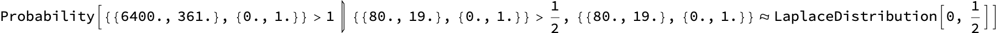
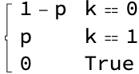
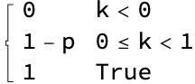

13.2.2025
The simple story
see Oxford Talk

### Bayes

(see: bayes.ipynb)
probability, conditional probability
Bayesian chain rule, Total probability, Bayes' theorem
Let A, B be any events. Bayes' Theorem tells us that

$P[A|B] = \frac{P[A]}{P[B]} P[B|A]\text{  }$
$x^{3 }$
Let $x$be a real variable, and let $y$ be another real variable such that $x \cdot  y = 0$. 

This is a table: $\text{Table}[2*n,\{n,1,3\}]$


```wl  <>StringReplace[StringReplace[First[$Failed], {ORYGINALMARK~~
...~~ :> , \~~
...~~ -> , 
...~~~~ ... -> }], MarkdownTools`Private`a:( | 
).. :> MarkdownTools`Private`a<> ]<>
In[]:=                                                                                                                                                                              ```







$$\text{let x be a real number}$$

|  |  |  |
| - | - | - |
| Let  | *x* |  be a real number |

```wl  <>StringReplace[StringReplace[First[$Failed], {ORYGINALMARK~~
...~~ :> , \~~
...~~ -> , 
...~~~~ ... -> }], MarkdownTools`Private`a:( | 
).. :> MarkdownTools`Private`a<>  ]<>
Out[]=                                                                                                                                                                               ```


#### Examples

life expectancy, Monty Hall, bags on a plane (AI33: tipping point)
conditional probability vs causality

#### Bayesian Decisions

P[cancer|test positive], P[test positive|cancer]
P[smoker|cancer], P[cancer|smoker]
prior probability, posterior probability, likelihood, likelihood ratio
False/true positives/negatives
precision, accuracy, recall, confusion matrix
More examples: Morse, alarm, mammography, Cabs
test vs. action AI35

```wl  <>StringReplace[StringReplace[First[$Failed], {ORYGINALMARK~~
...~~ :> , \~~
...~~ -> , 
...~~~~ ... -> }], MarkdownTools`Private`a:( | 
).. :> MarkdownTools`Private`a<> ]<>
In[]:=                                                                                                                                                                              ```

```wl  <>StringReplace[StringReplace[First[$Failed], {ORYGINALMARK~~
...~~ :> , \~~
...~~ -> , 
...~~~~ ... -> }], MarkdownTools`Private`a:( | 
).. :> MarkdownTools`Private`a<>  ]<>
Out[]=                                                                                                                                                                               ```

```wl  <>StringReplace[StringReplace[First[$Failed], {ORYGINALMARK~~
...~~ :> , \~~
...~~ -> , 
...~~~~ ... -> }], MarkdownTools`Private`a:( | 
).. :> MarkdownTools`Private`a<>  ]<>
Out[]=                                                                                                                                                                               ```

|  |  |
| - | - |
| 0.8 | 0.19 |
| 0. | 0.01 |

```wl  <>StringReplace[StringReplace[First[$Failed], {ORYGINALMARK~~
...~~ :> , \~~
...~~ -> , 
...~~~~ ... -> }], MarkdownTools`Private`a:( | 
).. :> MarkdownTools`Private`a<>  ]<>
Out[]=                                                                                                                                                                               ```

|  |  |
| - | - |
| 0.8080808080808082 | 0.19191919191919193 |
| 0. | 1. |

```wl  <>StringReplace[StringReplace[First[$Failed], {ORYGINALMARK~~
...~~ :> , \~~
...~~ -> , 
...~~~~ ... -> }], MarkdownTools`Private`a:( | 
).. :> MarkdownTools`Private`a<>  ]<>
Out[]=                                                                                                                                                                               ```

|  |  |
| - | - |
| 0.99 | 0.01 |

```wl  <>StringReplace[StringReplace[First[$Failed], {ORYGINALMARK~~
...~~ :> , \~~
...~~ -> , 
...~~~~ ... -> }], MarkdownTools`Private`a:( | 
).. :> MarkdownTools`Private`a<>  ]<>
Out[]=                                                                                                                                                                               ```

|  |  |
| - | - |
| 1.0101010101010104 | 0.9595959595959597 |
| 0. | 5. |

```wl  <>StringReplace[StringReplace[First[$Failed], {ORYGINALMARK~~
...~~ :> , \~~
...~~ -> , 
...~~~~ ... -> }], MarkdownTools`Private`a:( | 
).. :> MarkdownTools`Private`a<>  ]<>
Out[]=                                                                                                                                                                               ```

|  |  |
| - | - |
| 1. | 0.9500000000000001 |
| 0. | 0.05 |

```wl  <>StringReplace[StringReplace[First[$Failed], {ORYGINALMARK~~
...~~ :> , \~~
...~~ -> , 
...~~~~ ... -> }], MarkdownTools`Private`a:( | 
).. :> MarkdownTools`Private`a<> ]<>
In[]:=                                                                                                                                                                              ```

```wl  <>StringReplace[StringReplace[First[$Failed], {ORYGINALMARK~~
...~~ :> , \~~
...~~ -> , 
...~~~~ ... -> }], MarkdownTools`Private`a:( | 
).. :> MarkdownTools`Private`a<>  ]<>
Out[]=                                                                                                                                                                               ```

```wl  <>StringReplace[StringReplace[First[$Failed], {ORYGINALMARK~~
...~~ :> , \~~
...~~ -> , 
...~~~~ ... -> }], MarkdownTools`Private`a:( | 
).. :> MarkdownTools`Private`a<>  ]<>
Out[]=                                                                                                                                                                               ```

##### Computing the frequencies of dots and dashes

```wl  <>StringReplace[StringReplace[First[$Failed], {ORYGINALMARK~~
...~~ :> , \~~
...~~ -> , 
...~~~~ ... -> }], MarkdownTools`Private`a:( | 
).. :> MarkdownTools`Private`a<> ]<>
In[]:=                                                                                                                                                                              ```

```wl  <>StringReplace[StringReplace[First[$Failed], {ORYGINALMARK~~
...~~ :> , \~~
...~~ -> , 
...~~~~ ... -> }], MarkdownTools`Private`a:( | 
).. :> MarkdownTools`Private`a<>  ]<>
Out[]=                                                                                                                                                                               ```

```wl  <>StringReplace[StringReplace[First[$Failed], {ORYGINALMARK~~
...~~ :> , \~~
...~~ -> , 
...~~~~ ... -> }], MarkdownTools`Private`a:( | 
).. :> MarkdownTools`Private`a<>  ]<>
Out[]=                                                                                                                                                                               ```

#### Bayesian Networks

Bayesian networks - a generalization of Bayesian decisions